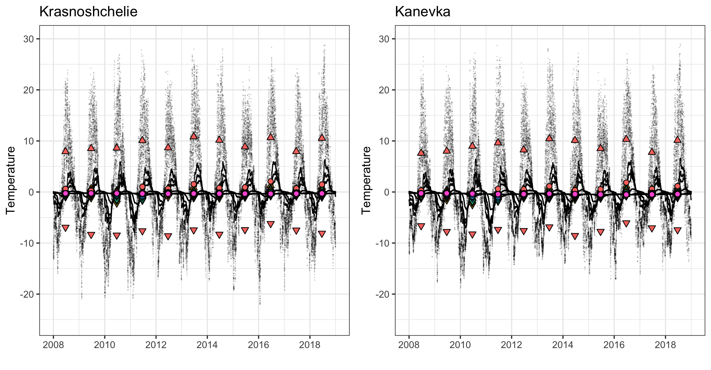

<style type="text/css">
.main-container {
  max-width: 1400px;
  margin-left: auto;
  margin-right: auto;
}
</style>

<details>
  <summary>R Library</summary>
  ```{r libraries, message=FALSE, warning=FALSE,  results=FALSE}
  library(readxl)
  library(ncdf4)
  library(raster)
  library(tidyverse)
  library(ggforce)
  library(grid)
  library(sf)
  sf::sf_use_s2(FALSE)
  ```
</details><br/> 


<details>
  <summary>in-situ dataset</summary>
  ```{r dataset v3, message=FALSE, warning=FALSE,  results=FALSE, eval = FALSE}
  v3_mean <- as_tibble(
    read.table("data/cci permafrost GT yearly/v3/20210218_focus_mean_yr_3.csv", sep = ";", dec = ".", header = T)
    ) %>%     
    mutate(Source = if_else(Source%in%c("M. Ulrich", "A. Kholodov", "PANGAEA", "Pangaea", "Wangetal"), "GTN-P", Source)) %>%
    mutate(Source = if_else(Source=="GTN-P", "GTN-P & USGS", if_else(Source=="Nordica", "Nordicana-D", Source))) %>%
    mutate(Source = if_else(Source=="Above", "NASA ABoVE", Source)) %>%
    select(c("cci_ID", "Dataset",  "Name", "Source", "Longitude", "Latitude", "Year", "Depth"), starts_with("X"), 
           -starts_with("X."), -"X") %>% 
    rename_at(vars(starts_with('X')), function(x) paste0("mean_", substring(x, 2, nchar(x)))) %>%
    rename(holeDepth = Depth)
  
  v3_min <- as_tibble(
    read.table("data/cci permafrost GT yearly/v3/20210218_focus_min__yr_3.csv", sep = ";", dec = ".", header = T)
    ) %>%     
    select(c("cci_ID", "Year"), starts_with("X")) %>% 
    rename_at(vars(starts_with('X')), function(x) paste0("min_", substring(x, 2, nchar(x))))
  
  v3_max <- as_tibble(
    read.table("data/cci permafrost GT yearly/v3/20210218_focus_max_yr_3.csv", sep = ";", dec = ".", header = T)
    ) %>%     
    select(c("cci_ID", "Year"), starts_with("X")) %>% 
    rename_at(vars(starts_with('X')), function(x) paste0("max_", substring(x, 2, nchar(x))))
  
  v3Dat <- v3_mean %>% left_join(v3_min, by = c("cci_ID", "Year"), ) %>%
    left_join(v3_max, by = c("cci_ID", "Year")) %>%
    left_join(as.tibble(read.table("data/finalmatchup.txt", header = T, sep = "\t")), by = "Name") %>%
    mutate(Latitude = if_else(is.na(Lat), Latitude, Lat), Longitude = if_else(is.na(Lon), Longitude, Lon)) %>%
    select(-Lon, -Lat) %>%
    mutate_at(vars(starts_with("m")), ~ as.numeric(as.character(.))) %>%
    pivot_longer(col = starts_with(c("m"))) %>% rename(Temperature = value) %>%
    mutate(Type = sub("_.*", "", name), Depth = as.factor(sub(".*_", "", name))) %>% select(-name) %>%
    select(c(cci_ID, Dataset, Name, Source, Longitude, Latitude, Year, holeDepth, Type, Depth, Temperature)) %>%
    filter(!is.na(Longitude), !is.na(Temperature))
  ```
</details><br/> 

<details>
  <summary>ISBA dataset</summary>
  ```{r ISBA data, message=FALSE, warning=FALSE,  results=FALSE, eval = FALSE}
  ncFile <- nc_open("data/TG_with_assimilation.nc")
  
  crds  <- matrix(c(ncvar_get(ncFile, "lon"), ncvar_get(ncFile, "lat")), ncol = 2, byrow = F)
  depth <- ncvar_get(ncFile, "depth")
  time  <- as.POSIXct("2008-01-01 00:00:00.0", tz = "UTC") + ncvar_get(ncFile, "time")*60*60
  tempA <- ncvar_get(ncFile, "temperature")
  
  nc_close(ncFile)
  
  ## closest site
  sf_sites <- st_as_sf(v3Dat %>% filter(!duplicated(Name)) %>% select(c(cci_ID, Name, Longitude, Latitude)),
                       coords = c("Longitude", "Latitude"), crs = 4326) 
  sf_crds  <- st_as_sfc(lapply(split(crds, 1:nrow(crds)), function(x) st_point(x)), crs = 4326)
  
  dat <- data.frame(Name = v3Dat %>% filter(!duplicated(Name)) %>% pull("Name"), 
                    apply(st_distance(sf_sites, sf_crds)/1000, 2, as.numeric))
  dat$site <- apply(dat[,-1],  1, function(x) which.min(x))
  dat$dist <- apply(dat[,2:5], 1, function(x) x[x[4]])
  sites    <- as_tibble(dat[!is.na(dat$dist),c(1,5:6)]) %>% arrange(site, dist) %>% filter(!duplicated(site))
  
  ## Annual min, mean, max
  out <- as_tibble(data.frame(Site  = rep(rep(sites$Name, each = dim(tempA)[1]), dim(tempA)[3]), 
                              Time  = rep(time, each = dim(tempA)[1]*dim(tempA)[2]),
                              Depth = rep(depth, dim(tempA)[2]*dim(tempA)[3]), Temp = c(tempA))) %>%
          mutate(Temp = Temp - 273.15)
  
  statsTab <- out %>% filter(Site!="Upper river Lotta") %>% 
    mutate(Year = as.numeric(format(Time, "%Y"))) %>%
    group_by(Site, Depth, Year) %>% 
    summarise_at(vars(Temp), list(Min = min, Mean = mean, Max = max)) %>%
    mutate(x = as.POSIXct(glue::glue("{Year}-06-21"))) %>%
    filter(Year<2019)
  
  plt <- lapply((sites %>% pull(Name))[1:2], function(s) {
    
  pl <- ggplot(NULL, aes(x, y)) +
    geom_point(data = out %>% filter(Site==s),
               mapping = aes(x = Time, y = Temp), shape = 16, size = 0.2, alpha = 0.2) +
    geom_point(data = statsTab %>% filter(Site==s),, 
               mapping = aes(x = x, y = Max, fill = as.factor(round(Depth*100,1))), 
               shape = 24, size = 2, show.legend = FALSE) +
    geom_point(data = statsTab %>% filter(Site==s),, 
               mapping = aes(x = x, y = Min, fill = as.factor(round(Depth*100,1))), 
               shape = 25, size = 2, show.legend = FALSE) +
    geom_point(data = statsTab %>% filter(Site==s), 
               mapping = aes(x = x, y = Mean, fill = as.factor(round(Depth*100,1))), 
               shape = 21, size = 2, show.legend = FALSE) +
    ylim(range(out$Temp, na.rm = T)) +
    labs(y = "Temperature", x = "", title = s) +
    theme(text = element_text(size=rel(4))) +
    theme_bw()
  })
  
  png("figures/Figure_1.1.png", width = 23, height = 12, units = "cm", res = 250)
    gridExtra::grid.arrange(plt[[1]], plt[[2]], nrow = 1)
  dev.off()
  ```  
</details><br/> 



_Figure 1.1: ISBA simulation data for two sites. Gray dots show original ground temperature at different depths and a 3 hour interval. Colored circles are annual mean ground temperatures for different depths. Triangles to top and bottom show maximal annual and minimal annual ground temperatures respectively._
