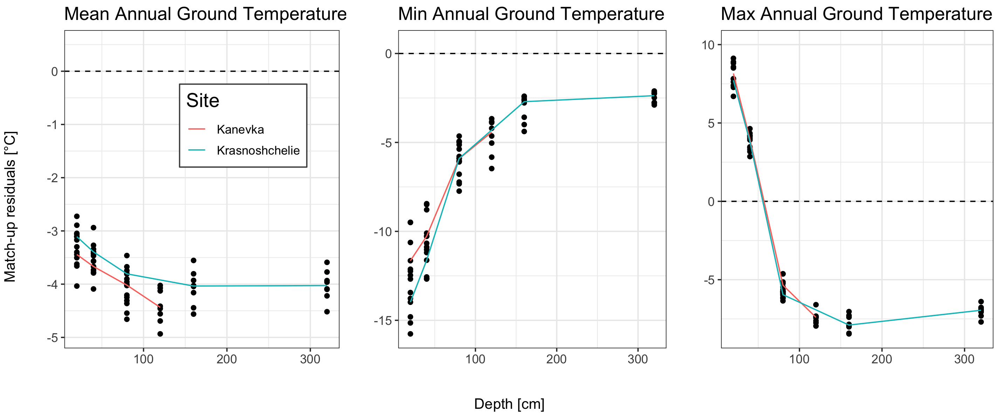

<style type="text/css">
.main-container {
  max-width: 1400px;
  margin-left: auto;
  margin-right: auto;
}
</style>

<details>
  <summary>R Library</summary>
  ```{r libraries, message=FALSE, warning=FALSE,  results=FALSE}
  library(readxl)
  library(ncdf4)
  library(raster)
  library(tidyverse)
  library(ggforce)
  library(grid)
  library(sf)
  sf::sf_use_s2(FALSE)
  ```
</details><br/> 

```{r load, echo = FALSE}
load("data/v3Dat.rda")
load("data/isbaDat.rda")

statsTab <- isbaDat %>% filter(Site!="Upper river Lotta") %>% 
  mutate(Year = as.numeric(format(Time, "%Y"))) %>%
  group_by(Site, Depth, Year) %>% 
  summarise_at(vars(Temp), list(Min = min, Mean = mean, Max = max)) %>%
  filter(Year<2019) %>%
  pivot_longer(cols = c(Min, Mean, Max)) %>% 
  mutate(Type = ifelse(name=="Mean", "mean", ifelse(name=="Max", "max", "min"))) %>%
  select(-name) %>% mutate(Depth = Depth*100)
```

<details>
  <summary>Match-up</summary>
  ```{r}
  v3match <- v3Dat %>% filter(Name%in%unique(statsTab$Site) & Year%in%statsTab$Year)
  v3match$ISBA <- apply(as.data.frame(v3match), 1, function(x) {
    tmp <- statsTab %>% filter(Site==as.character(x[3]) & Year==as.numeric(x[7]) & Type==as.character(x[9]))
    approx(x = tmp$Depth, y = tmp$value, xout = x[10])$y
  })
  v3match <- v3match %>% mutate(resid = ISBA - Temperature)
  ```
</details><br/> 


<details>
  <summary>Match-up</summary>
  ```{r distr plots, eval = FALSE}
  histDat <- v3match %>% select(Type, Temperature, ISBA) %>% 
    pivot_longer(cols = c(Temperature, ISBA)) %>% mutate(name = ifelse(name=="Temperature", "In-situ", name))
  
  png("figures/Figure_2.1.png", width = 29, height = 12, units = "cm", res = 250)
  ggplot(histDat) + geom_histogram(aes(x = value, fill = name), binwidth=1, position="dodge") +
    theme_bw() + labs(x = "Ground temperature", y = "Frequency") +
    facet_grid(~ as.factor(Type))
  dev.off()
  ```
</details><br/> 


_Figure 2.1: Frequency distribution of annual ground temperatures for in-site measurements and ISBA simulation._


<details>
  <summary>Summary plot</summary>
  ```{r plot, eval = FALSE}
  mean <- ggplot(NULL, aes(x,y)) +
    geom_point(data = v3match %>% filter(Type=="mean"), mapping = aes(as.numeric(as.character(Depth)), resid)) +
    ylim(min(v3match %>% filter(Type=="mean") %>% pull(resid)), 0.5) +
    geom_hline(yintercept = 0, linetype = "dashed") + 
    labs(y = "", x = "", title = "Mean Annual Ground Temperature", col = "Site") +
    geom_line(data = v3match %>% filter(Type=="mean") %>% group_by(Name, Depth) %>% 
    summarise(mSite = median(resid)),
              mapping = aes(x = as.numeric(as.character(Depth)), y = mSite, col = Name)) +
    theme_bw() +
    theme(text = element_text(size=rel(4)), plot.title = element_text(size=15),
          legend.position = c(0.65, 0.7),
          legend.background = element_rect(fill = "white", size=0.5, linetype="solid", 
                                    colour ="grey29"),
          legend.text = element_text(size=10))
  
  max <- ggplot(NULL, aes(x,y)) +
    geom_point(data = v3match %>% filter(Type=="max"), mapping = aes(as.numeric(as.character(Depth)), resid)) +
    ylim(min(v3match %>% filter(Type=="max") %>% pull(resid)), 10) +
    geom_hline(yintercept = 0, linetype = "dashed") + 
    labs(y = "", x = "", title = "Max Annual Ground Temperature", col = "Site") +
    geom_line(data = v3match %>% filter(Type=="max") %>% group_by(Name, Depth) %>% summarise(mSite = median(resid)),
              mapping = aes(x = as.numeric(as.character(Depth)), y = mSite, col = Name), show.legend = F) +
    theme_bw() +
    theme(text = element_text(size=rel(4)), plot.title = element_text(size=15))
  
  min <- ggplot(NULL, aes(x,y)) +
    geom_point(data = v3match %>% filter(Type=="min"), mapping = aes(as.numeric(as.character(Depth)), resid)) +
    ylim(min(v3match %>% filter(Type=="min") %>% pull(resid)), 0.5) +
    geom_hline(yintercept = 0, linetype = "dashed") + 
    labs(y = "", x = "", title = "Min Annual Ground Temperature", col = "Site") +
    geom_line(data = v3match %>% filter(Type=="min") %>% group_by(Name, Depth) %>% summarise(mSite = median(resid)),
              mapping = aes(x = as.numeric(as.character(Depth)), y = mSite, col = Name), show.legend = F) +
    theme_bw() +
    theme(text = element_text(size=rel(4)), plot.title = element_text(size=15))
  
  png("figures/Figure_2.2.png", width = 29, height = 12, units = "cm", res = 250)
      gridExtra::grid.arrange(mean, min, max, nrow = 1, bottom = "Depth [cm]", left = "Match-up residuals [°C]")
  dev.off()
  ```
</details><br/> 




_Figure 2.2: Residuals of Match-up temperature data between in-situ measurements and ISBA simulation._

