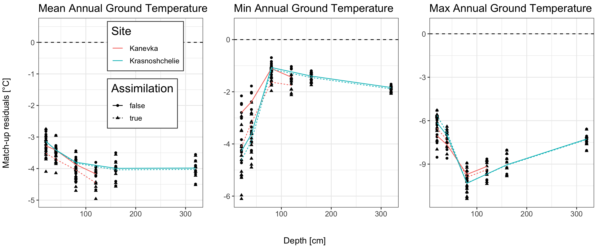

<style type="text/css">
.main-container {
  max-width: 1400px;
  margin-left: auto;
  margin-right: auto;
}
</style>

<details>
  <summary>R Library</summary>
  ```{r libraries, message=FALSE, warning=FALSE,  results=FALSE}
  library(readxl)
  library(ncdf4)
  library(raster)
  library(tidyverse)
  library(ggforce)
  library(grid)
  library(sf)
  sf::sf_use_s2(FALSE)
  ```
</details><br/> 

```{r load, echo = FALSE, message=FALSE, warning=FALSE}
load("data/v3Dat.rda")
load("data/isbaDat.rda")

statsTab <- isbaDat %>% filter(Site!="Upper river Lotta") %>% 
  mutate(Year = as.numeric(format(Time, "%Y")), Month = as.numeric(format(Time, "%m"))) %>%
  group_by(Site, Depth, Year, Month) %>% 
  summarise(Min1 = min(Temp_1), Mean1 = mean(Temp_1), Max1 = max(Temp_1),
            Min2 = min(Temp_2), Mean2 = mean(Temp_2), Max2 = max(Temp_2)) %>%
  group_by(Site, Depth, Year) %>% 
  summarise(Mean1 = mean(Mean1), Max1 = mean(Max1), Min1 = mean(Min1),
            Mean2 = mean(Mean2), Max2 = mean(Max2), Min2 = mean(Min2)) %>%
  filter(Year<2019) %>%
  pivot_longer(cols = c(Min1, Mean1, Max1, Min2, Mean2, Max2)) %>% 
  mutate(Dataset = ifelse(endsWith(name, "1"), "Ass_true", "Ass_false"),
         Type = ifelse(startsWith(name, "Mean"), "mean", ifelse(startsWith(name, "Max"), "max", "min"))) %>%
  select(-name) %>% mutate(Depth = Depth*100) %>% rename(Temperature = value)
```

<details>
  <summary>Match-up</summary>
  ```{r}
    v3match <- v3Dat %>% filter(Name%in%unique(statsTab$Site) & Year%in%statsTab$Year)
    v3match$ISBA_true <- apply(as.data.frame(v3match), 1, function(x) {
      tmp <- statsTab %>% filter(Site==as.character(x[3]) & Year==as.numeric(x[7]) & Type==as.character(x[9]))
      with(tmp %>% filter(Dataset=="Ass_true"), approx(x = Depth, y = Temperature, xout = x[10])$y)
    })
    v3match$ISBA_false <- apply(as.data.frame(v3match), 1, function(x) {
      tmp <- statsTab %>% filter(Site==as.character(x[3]) & Year==as.numeric(x[7]) & Type==as.character(x[9]))
      with(tmp %>% filter(Dataset=="Ass_false"), approx(x = Depth, y = Temperature, xout = x[10])$y)
    })
    v3match <- v3match %>% mutate(Delta_true = ISBA_true - Temperature, Delta_false = ISBA_false - Temperature)
   ```
</details><br/> 


<details>
  <summary>Match-up</summary>
  ```{r distr plots, eval = FALSE}
    histDat <- v3match %>% select(Type, Temperature, ISBA_true, ISBA_false) %>% 
      pivot_longer(cols = c(Temperature, ISBA_true, ISBA_false)) %>% mutate(name = ifelse(name=="Temperature", "In-situ", name))
    
    png("figures/Figure_2.1.png", width = 29, height = 12, units = "cm", res = 250)
    ggplot(histDat) + geom_histogram(aes(x = value, fill = name), binwidth=1.5, position="dodge") +
      theme_bw() + labs(x = "Ground temperature", y = "Frequency", fill = "Dataset") +
      facet_grid(~ as.factor(Type))
    dev.off()
  ```
</details><br/> 


_Figure 2.1: Frequency distribution of annual ground temperatures for in-site measurements and ISBA simulation (true = with assimitation, false = without assimilation)._

<details>
  <summary>Summary plot</summary>
  ```{r plot}
  dset <- v3match %>% select(Name, Type, Depth, Delta_true, Delta_false) %>%
    pivot_longer(c(Delta_true, Delta_false)) %>% rename(Assimilation = name) %>%
    mutate(Assimilation = ifelse(endsWith(Assimilation, "true"), "true", "false"))
  
    mean <- ggplot(NULL, aes(x,y)) +
      geom_point(data = dset %>% filter(Type=="mean"), 
                 mapping = aes(as.numeric(as.character(Depth)), value, shape = Assimilation)) +
      ylim(min(dset %>% filter(Type=="mean") %>% pull(value)), 0.5) +
      geom_hline(yintercept = 0, linetype = "dashed") + 
      labs(y = "", x = "", title = "Mean Annual Ground Temperature", col = "Site") +
      geom_line(data = dset %>% filter(Type=="mean") %>% group_by(Name, Depth, Assimilation) %>% 
                        summarise(mSite = median(value)),
                mapping = aes(x = as.numeric(as.character(Depth)), y = mSite, col = Name, linetype = Assimilation)) +
      theme_bw() +
      theme(text = element_text(size=rel(4)), plot.title = element_text(size=15),
            legend.position = c(0.65, 0.7),
            legend.background = element_rect(fill = "white", size=0.5, linetype="solid", 
                                      colour ="grey29"),
            legend.text = element_text(size=10))
    
    max <- ggplot(NULL, aes(x,y)) +
      geom_point(data = dset %>% filter(Type=="max"), 
                 mapping = aes(as.numeric(as.character(Depth)), value, shape = Assimilation), show.legend = FALSE) +
      ylim(min(dset %>% filter(Type=="max") %>% pull(value)), 0.5) +
      geom_hline(yintercept = 0, linetype = "dashed") + 
      labs(y = "", x = "", title = "Max Annual Ground Temperature", col = "Site") +
      geom_line(data = dset %>% filter(Type=="max") %>% group_by(Name, Depth, Assimilation) %>% 
                        summarise(mSite = median(value)),
                mapping = aes(x = as.numeric(as.character(Depth)), y = mSite, col = Name, linetype = Assimilation), show.legend = FALSE) +
      theme_bw() +
      theme(text = element_text(size=rel(4)), plot.title = element_text(size=15))
    
    min <- ggplot(NULL, aes(x,y)) +
      geom_point(data = dset %>% filter(Type=="min"), 
                 mapping = aes(as.numeric(as.character(Depth)), value, shape = Assimilation), show.legend = FALSE) +
      ylim(min(dset %>% filter(Type=="min") %>% pull(value)), 0.5) +
      geom_hline(yintercept = 0, linetype = "dashed") + 
      labs(y = "", x = "", title = "Min Annual Ground Temperature", col = "Site") +
      geom_line(data = dset %>% filter(Type=="min") %>% group_by(Name, Depth, Assimilation) %>% 
                        summarise(mSite = median(value)),
                mapping = aes(x = as.numeric(as.character(Depth)), y = mSite, col = Name, linetype = Assimilation), show.legend = FALSE) +
      theme_bw() +
      theme(text = element_text(size=rel(4)), plot.title = element_text(size=15))
    
    png("figures/Figure_2.2.png", width = 29, height = 12, units = "cm", res = 250)
        gridExtra::grid.arrange(mean, min, max, nrow = 1, bottom = "Depth [cm]", left = "Match-up residuals [°C]")
    dev.off()
  ```
</details><br/> 



_Figure 2.2: Residuals of Match-up temperature data between in-situ measurements and ISBA simulation (residuals = ISBA simulation - in-situ Temperature)._

<details>
  <summary>Bias table</summary>
  ```{r bias, eval = FALSE}
  biasTab <- v3match %>% pivot_longer(c(Delta_true, Delta_false)) %>%
    rename(Assimilation = name, Delta = value) %>% mutate(Assimilation = ifelse(endsWith(Assimilation, "true"), "true", "false")) %>%
    group_by(Name, Type, Assimilation) %>% summarise(q50_bias = median(Delta), q5_bias = quantile(Delta, probs = 0.05), 
                                                     q95_bias = quantile(Delta, probs = 0.95))
  ```
</details><br/> 

_Table 2.1: Median (and 5% as well as 95% credibility interval) of the bias between ISBA annual (mean, min, max) ground temperatures and in-situ ground temperature measurements._

